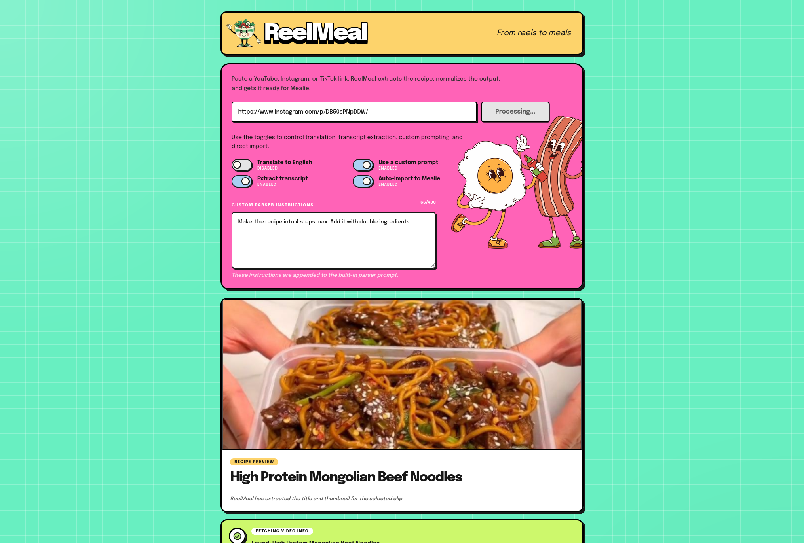
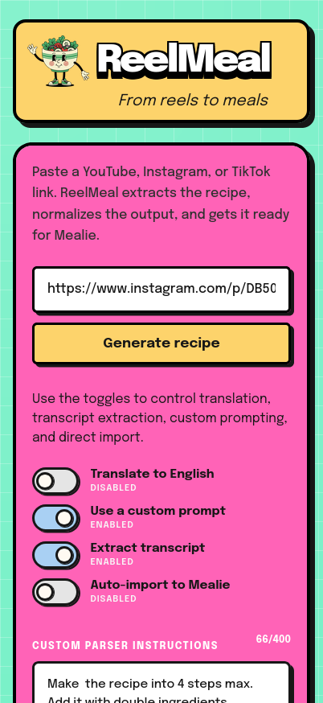

# ReelMeal

Turn YouTube, Instagram, and TikTok cooking videos into Mealie recipes.

Paste a link, let ReelMeal pull the metadata and transcript, then send the cleaned-up recipe straight into your Mealie instance.

## Screenshots

<p align="center">
  
  
</p>

## What it does

- pulls title, description, thumbnail, and transcript from supported video links
- parses the result into a structured recipe with an LLM
- optionally translates to English
- optionally imports the recipe directly into Mealie
- lets you add a short custom parser prompt per run

## Stack

- React + Vite frontend
- Hono backend
- `yt-dlp` + `ffmpeg` for media extraction
- OpenAI-compatible API for parsing and transcription fallback
- Mealie for final recipe import

## Requirements

- Node.js 22+
- `ffmpeg`
- `yt-dlp`
- a Mealie instance
- an OpenAI-compatible API key

## Quick start

```bash
cp .env.example .env
npm install
npm install --prefix client
npm run dev
```

Open:

- frontend: `http://localhost:5173`
- backend: `http://localhost:3000`

## Sharing to the app

ReelMeal can prefill the URL input from a query param:

```text
https://your-domain.com/?url=<url-encoded-video-link>
```

This is useful for mobile sharing flows.

- Android: when ReelMeal is installed as a PWA, it can appear in the system share sheet and receive shared links directly.
- iPhone/iPad: iOS does not offer the same PWA share target support, but you can use a Shortcut that opens ReelMeal with the shared link in `?url=`.

iOS Shortcut:

- https://www.icloud.com/shortcuts/3d9043bcd7b14fe290ff826b11a426a3

The shared link should be URL-encoded when building the `?url=` value.

## Docker

Build it yourself:

```bash
docker compose up --build
```

Or run the published image from GitHub Container Registry:

```bash
docker run --rm -p 3000:3000 --env-file .env ghcr.io/karamanliev/reel-meal:latest
```

If you prefer Compose with the published image:

```yaml
services:
  reel-meal:
    image: ghcr.io/karamanliev/reel-meal:latest
    ports:
      - "3000:3000"
    env_file:
      - .env
    volumes:
      - ./cookies.txt:/app/cookies.txt:ro
    restart: unless-stopped
```

The `cookies.txt` mount is optional, but useful for Instagram and other sources that need authenticated `yt-dlp` requests.

## Environment

Required:

- `OPENAI_API_KEY`
- `MEALIE_URL`
- `MEALIE_API_TOKEN`

Common optional settings:

- `OPENAI_BASE_URL`
- `OPENAI_MODEL`
- `TRANSCRIPTION_MODEL`
- `WHISPER_API_URL`
- `WHISPER_TIMEOUT_MS`
- `SKIP_LOCAL_WHISPER`
- `PORT`

See `.env.example` for the full list.

## Instagram notes

Instagram often needs cookies. If a link works in your browser but not in ReelMeal, export a `cookies.txt` file for `yt-dlp` and place it in the project root.

If you run ReelMeal in Docker, mount it into the container at `/app/cookies.txt`.

Example:

```bash
yt-dlp --cookies-from-browser chrome --cookies cookies.txt "https://www.instagram.com/reel/abc123/"
```

Swap `chrome` for `firefox`, `edge`, or `chromium` if needed.

## Build

```bash
npm run build
npm start
```

## Supported sources

- YouTube
- Instagram reels and posts
- TikTok
- other sites supported by `yt-dlp`

## Todo

- [x] Video queuing
- [x] Reprompt the model for changes when auto-import is off
