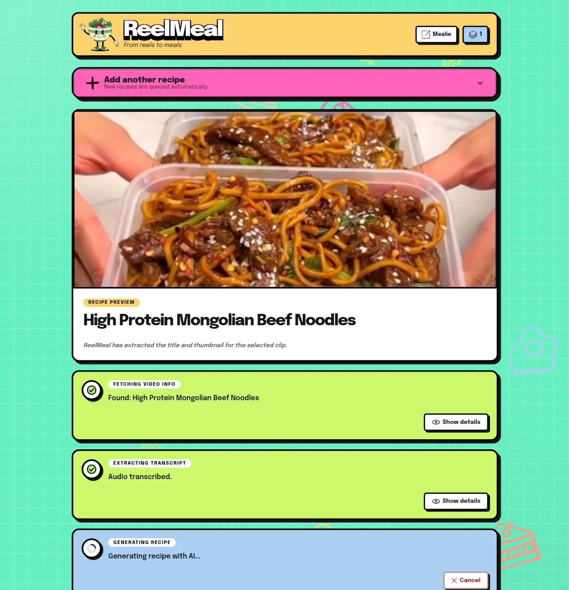
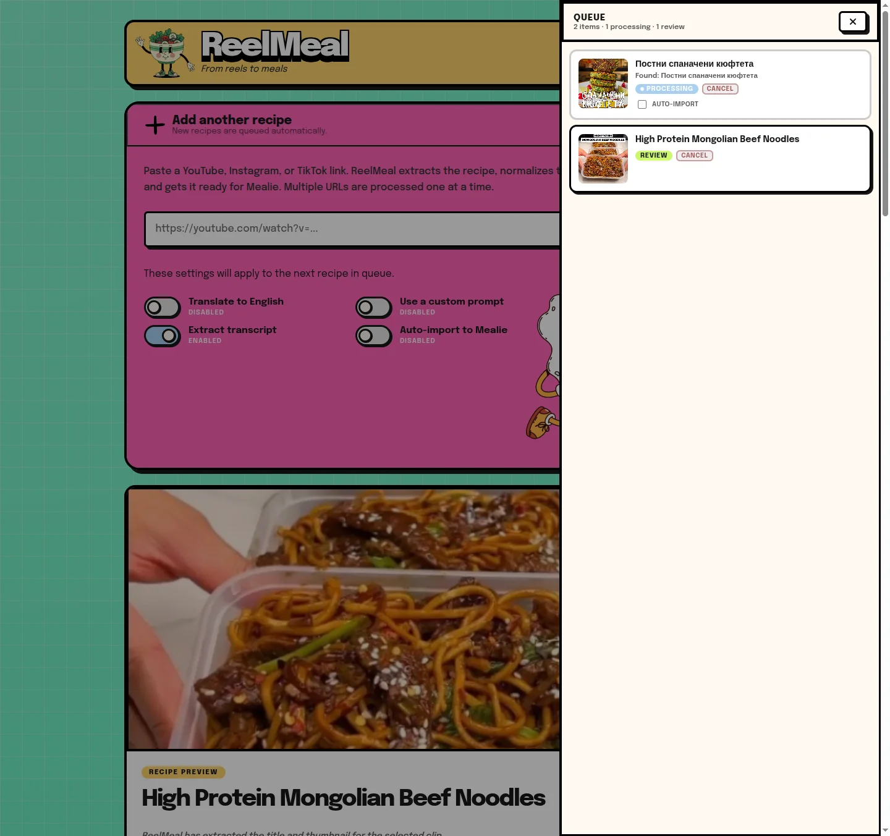
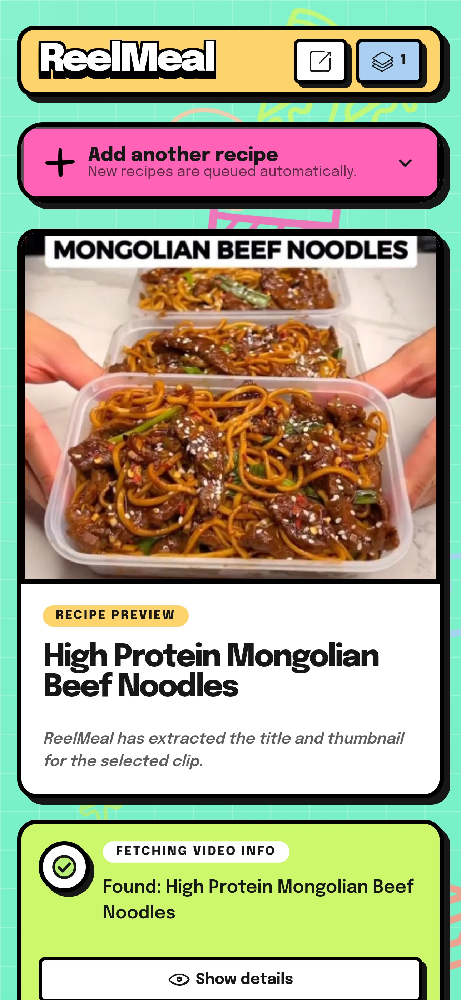
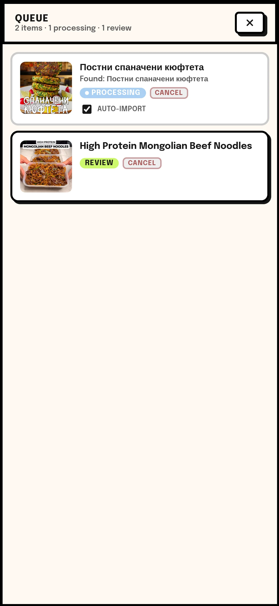
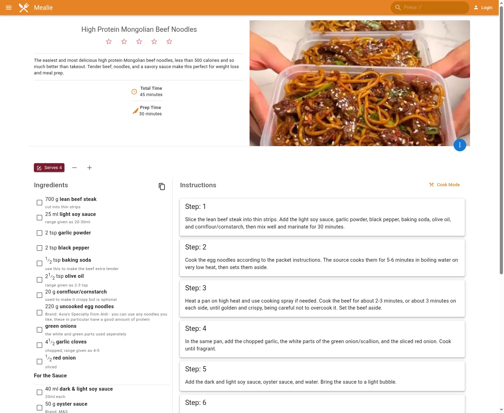

# ReelMeal

Turn videos, recipe webpages, pasted text, and recipe images into Mealie recipes.

Paste a URL or recipe, add images, review the generated recipe, then send it to Mealie.

## Screenshots

### Desktop

<p>
  
  
</p>

### Mobile

<p>
  
  
</p>

### Imported Recipe

<p>
  
</p>

## What it does

- accepts one exact HTTP(S) URL, pasted recipe text, or an ordered image set
- tries video extraction first for URLs, then static Schema.org Recipe data and readable webpage content
- accepts images from the picker, drag and drop, clipboard paste, and supported PWA share sheets
- parses the result into a structured recipe with an LLM
- keeps the source language by default; request a translation through the custom prompt
- optionally imports the recipe directly into Mealie
- lets you add a short custom parser prompt per run
- supports a separate custom Mealie cover that is never sent to the recipe model

## Stack

- React + Vite frontend
- Hono backend
- `yt-dlp` + `ffmpeg` for media extraction
- OpenAI-compatible API for parsing and transcription fallback
- Mealie for final recipe import

## Requirements

- Node.js 22+
- `ffmpeg`
- `yt-dlp`
- a Mealie instance
- an OpenAI-compatible API key and a configured `OPENAI_MODEL` that supports image input

## Quick start

```bash
cp .env.example .env
npm install
npm install --prefix client
npm run dev
```

Open:

- frontend: `http://localhost:5173`
- backend: `http://localhost:3000`

## Inputs and limits

The smart input classifies trimmed content as a URL only when the complete value is one HTTP(S) URL. Prose containing a URL is treated as pasted text. A job cannot mix recipe source types.

- Pasted or extracted model input: 100,000 normalized characters. Oversized content is rejected, not truncated.
- Source images: JPEG, PNG, WebP, or GIF; up to 10 files, 10 MB each, and 50 MB combined.
- Custom final image: one additional supported image up to 10 MB.
- Cover priority: custom image, model-selected source image, video thumbnail or webpage image, then no image.
- GIF originals are retained for Mealie. Provider support for animated GIF analysis varies.

Recipe pages must be public and server rendered. JavaScript-only, paywalled, and login-only pages are not supported.

## Sharing to the app

ReelMeal can prefill the smart input from a query parameter:

```text
https://your-domain.com/?url=<url-encoded-video-link>
```

This is useful for mobile sharing flows.

- Android and other supporting platforms: the installed PWA can receive URLs, text, and image files. Shared content is stored briefly and prefills the form, but is never submitted automatically.
- iPhone/iPad: iOS does not offer the same PWA share target support, but you can use a Shortcut that opens ReelMeal with the shared link in `?url=`.

iOS Shortcut:

- https://www.icloud.com/shortcuts/3d9043bcd7b14fe290ff826b11a426a3

The shared link should be URL-encoded when building the `?url=` value.

## Docker

Build it yourself:

```bash
docker compose up --build
```

Or run the published image from GitHub Container Registry:

```bash
docker run --rm -p 3000:3000 --env-file .env ghcr.io/karamanliev/reel-meal:latest
```

If you prefer Compose with the published image:

```yaml
services:
  reel-meal:
    image: ghcr.io/karamanliev/reel-meal:latest
    ports:
      - "3000:3000"
    env_file:
      - .env
    volumes:
      - ./cookies.txt:/app/cookies.txt:ro
    restart: unless-stopped
```

The `cookies.txt` mount is optional, but useful for Instagram and other sources that need authenticated `yt-dlp` requests.

## Environment

Required:

- `OPENAI_API_KEY`
- `MEALIE_URL`
- `MEALIE_API_TOKEN`

Common optional settings:

- `OPENAI_BASE_URL`
- `OPENAI_MODEL`
- `TRANSCRIPTION_MODEL`
- `WHISPER_API_URL`
- `WHISPER_TIMEOUT_MS`
- `SKIP_LOCAL_WHISPER`
- `PORT`

See `.env.example` for the full list.

## Instagram notes

Instagram often needs cookies. If a link works in your browser but not in ReelMeal, export a `cookies.txt` file for `yt-dlp` and place it in the project root.

If you run ReelMeal in Docker, mount it into the container at `/app/cookies.txt`.

Example:

```bash
yt-dlp --cookies-from-browser chrome --cookies cookies.txt "https://www.instagram.com/reel/abc123/"
```

Swap `chrome` for `firefox`, `edge`, or `chromium` if needed.

## Build

```bash
npm run build
npm start
```

## Supported sources

- YouTube
- Instagram reels and posts
- TikTok
- other sites supported by `yt-dlp`
- public static recipe pages with Schema.org Recipe JSON-LD or readable content
- pasted complete recipes
- JPEG, PNG, WebP, and GIF recipe images

## Storage and security

The queue is held in memory and does not survive a server restart. Upload-backed completed and failed jobs retain files for 24 hours to support review and reprompting. Cancelling or manually removing a job deletes its files immediately. Startup removes stale temporary directories.

Remote HTML and images use protocol, DNS, redirect, content-type, timeout, and byte-limit checks to reduce SSRF risk. The initial video URL receives the same validation. Extractor-specific secondary requests made by `yt-dlp` are outside application-level redirect control; deployment-level egress filtering is required for complete isolation.

ReelMeal has no built-in authentication or rate limiting. Do not expose it to untrusted users without an authenticated reverse proxy or a private network.

## Todo

- [x] Video queuing
- [x] Reprompt the model for changes when auto-import is off
- [x] Support images, recipe page links, and pasted text as recipe inputs
- [ ] Options/settings panel (in-app UI) instead of editing `.env` manually
